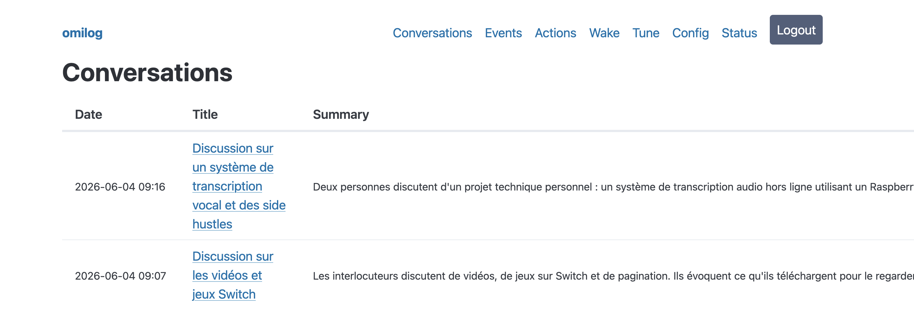
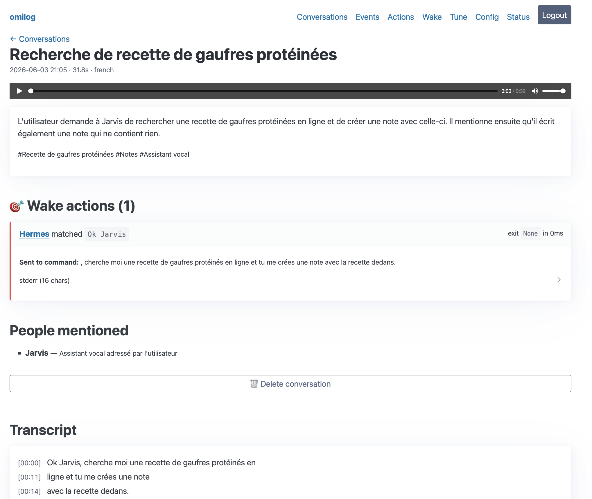
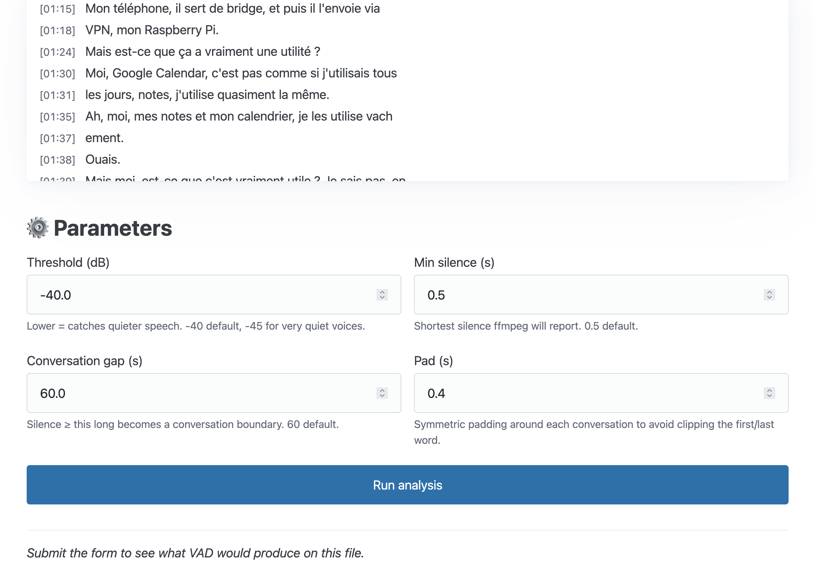
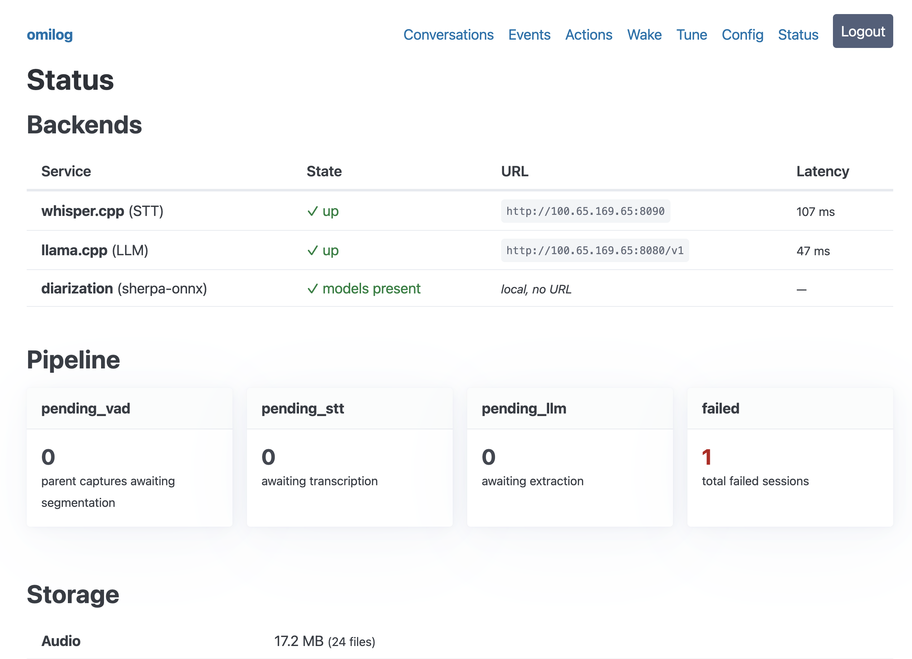

# omilog

[](https://github.com/MayeulHP/omilog/actions/workflows/test.yml)

Self-hosted personal conversation capture. The [Omi](https://www.omi.me/) necklace
streams audio to your phone over BLE, the phone forwards it to a Raspberry Pi over
your tailnet, and a small FastAPI service segments, transcribes, and extracts
structured information from your daily conversations on hardware you own.

You get a browsable archive of everything you said and to whom, with calendar
events, action items and mentioned people extracted automatically, plus an iCal
feed your calendar app can subscribe to.

```
┌──────────────┐   BLE Opus    ┌────────────────────┐
│ Omi necklace │ ───────────►  │  Phone (Chronicle  │
└──────────────┘               │   pre-built APK)   │
                               │  + Tailscale       │
                               └────────┬───────────┘
                                        │ WSS /ws  (Wyoming protocol)
                                        │ HTTPS REST (JWT auth)
                                        ▼
                               ┌────────────────────┐
                               │  Raspberry Pi      │
                               │  omilog (FastAPI)  │
                               │  SQLite + WAVs     │
                               │  Caddy / TS serve  │
                               └────────┬───────────┘
                                        │ HTTP over tailnet
                          ┌─────────────┼─────────────┐
                          ▼                           ▼
                ┌──────────────────┐        ┌──────────────────┐
                │ GPU host         │        │ GPU host         │
                │ whisper.cpp      │        │ llama.cpp        │
                │ /inference       │        │ /v1/chat/…       │
                └──────────────────┘        └──────────────────┘
```

The Pi only handles capture, storage, segmentation, and orchestration. Heavy
inference (Whisper, an LLM) lives on whatever GPU box you already have on your
tailnet. If you don't have one, both servers run fine on CPU, just slower.

Status: works end-to-end for the author's daily use. Built for one person but
the schema is multi-user-ready if you want to extend it.

## Screenshots

<!-- TODO: replace placeholders below with real screenshots from your install -->

| Conversation list | Conversation detail |
|---|---|
|  |  |

| VAD tuning | Status dashboard |
|---|---|
|  |  |

## Features

* All-day capture. Tap "start recording" once, the WebSocket auto-rolls over
  every 30 min (configurable) so conversations land in the UI throughout the
  day rather than waiting for an end-of-day disconnect. A mid-day crash at
  worst loses the current segment.
* Silence-aware segmentation. ffmpeg's `silencedetect` finds conversation
  boundaries (long silence between speech blocks), splits one BLE session
  into N child conversations, and trims out the silence in between. Roughly
  80 to 90 percent disk savings on a typical day.
* Transcription. WAV to whisper.cpp `whisper-server`. Defaults to French
  detection but works in any Whisper-supported language.
* Extraction. An LLM (any OpenAI-compatible endpoint: llama.cpp, vLLM, etc.)
  produces a strict-JSON summary, calendar events, action items, mentioned
  people, and topics. Conservative prompt: false positives are worse than
  misses.
* Speaker diarization, opt-in. Pure-local sherpa-onnx, no HuggingFace, no
  PyTorch. Annotates each transcript segment with `USER` (the necklace
  wearer) and `S1`, `S2`, and so on.
* Cross-conversation speaker linking. Per-cluster NeMo TitaNet embeddings
  are stored on first hearing; the same voice in a future conversation
  matches via cosine similarity (configurable threshold) and reuses the
  same `Speaker` row. Name a voice once at `/speakers` or on any
  conversation page and the name shows up everywhere that voice appears.
* Robust LLM parsing. `json_repair` fallback recovers partial extractions
  when the LLM hits its max-tokens cap. Affected conversations are flagged
  in the UI.
* iCal feed. `/calendar.ics?token=…` for calendar app subscription, plus
  per-event `.ics` download buttons.
* Web UI. Server-rendered Jinja + HTMX, no JS build step.
  * Conversation list and detail (with audio playback and transcript).
  * Upcoming events and open action items (with HTMX done/snooze).
  * Person aggregation (proto-CRM).
  * Live VAD parameter tuning page with timeline visualization.
  * `/config` page for editing non-secret settings from the browser.
* JSON API. The same data the UI uses is available at `/api/*` with the same
  JWT, so future MCP servers or scripts can read your archive.
* Single-command setup. `./scripts/start.sh` bootstraps the venv, prompts
  for credentials, syncs deps, and starts uvicorn. Re-running just brings
  the service up.

## Quick start

```bash
git clone https://github.com/MayeulHP/omilog ~/omilog
cd ~/omilog
./scripts/start.sh
```

The first run prompts for a username and password, writes a `.env`, downloads
deps via `uv` (falls back to `pip` if absent), then starts uvicorn on
`127.0.0.1:8000`. Subsequent runs skip the bootstrap and just sync deps then
start.

Then in a browser: `http://localhost:8000/` and log in. You'll land on an empty
conversation list. To hook up the rest of the stack, see the sections below.

## Hardware

| Role | What it does | Recommended |
|---|---|---|
| Phone | Holds the BLE link to the Omi and forwards over Tailscale | Any modern Android (iOS works but APK signing is friction). Disable battery optimization for Chronicle. |
| Pi (or any always-on Linux box) | Runs omilog, stores audio + DB, orchestrates inference | Pi 5 with 8 GB RAM and an NVMe HAT, or any always-on Linux machine on your tailnet |
| GPU box (optional) | Hosts whisper.cpp + llama.cpp servers | Any NVIDIA, AMD, or Apple Silicon you already have. CPU works too, just slower. A single-purpose Pi can transcribe. |
| Network | Tailscale | All three machines joined to the same tailnet |

Storage budget: at roughly 5 KB/s of Opus and 80 percent silence-trimmed via
VAD, plan 50 to 200 MB/day of audio for a heavy talker. The SQLite DB stays
tiny.

## Setup

### 1. The Pi

```bash
git clone https://github.com/MayeulHP/omilog /opt/omilog
cd /opt/omilog
./scripts/start.sh    # first-time bootstrap: prompts for credentials, etc.
```

If you want it to come back up after reboot, install the systemd unit:

```bash
sudo cp deploy/omilog.service /etc/systemd/system/
sudo systemctl daemon-reload
sudo systemctl enable --now omilog
```

The unit binds to `127.0.0.1:8000`. Front it with Caddy or `tailscale serve`
for HTTPS over the tailnet:

```bash
# simplest:
sudo tailscale serve --bg --https=443 127.0.0.1:8000
```

After this, your Pi is reachable at `https://pi.your-tailnet.ts.net/` from any
device on your tailnet.

### 2. The GPU box

omilog talks to two HTTP servers, neither of which needs to be on the same
host:

* **whisper.cpp `whisper-server`** for speech-to-text. See
  [`docs/whisper-server.md`](docs/whisper-server.md) for the full setup.
  Recommended model: `large-v3-turbo-q5_0` (around 530 MB, multilingual).
* **llama.cpp `llama-server`** or anything else that speaks the OpenAI
  `/v1/chat/completions` API. omilog ships with prompts tuned for Qwen3-class
  models and was tested with Qwen3 30B-A3B-Q4_K_XL. Smaller models can work
  if you relax the `response_format` constraint.

Both should bind to your tailnet interface only (not `0.0.0.0`), so they
aren't exposed to the public internet by accident.

**Hosted-API escape hatch.** If you don't have local hardware capable of
running either model, omilog accepts any OpenAI-compatible endpoint at the
same config keys. You can point `OMILOG_LLM_BASE_URL` at
`https://api.openai.com/v1` with an API key in `OMILOG_LLM_API_KEY` (or any
other OpenAI-shaped service: Anthropic via a proxy, Mistral, Groq, OpenRouter,
etc.), and `OMILOG_STT_BASE_URL` at OpenAI's audio endpoint. The setup is
trivial. The trade-off is that every conversation's audio and transcript
leaves your network, which defeats the project's whole self-hosted premise.
Use only if you've thought about it.

Once both are running, point omilog at them. The easiest path is the browser
at `/config`, or edit `.env`:

```env
OMILOG_STT_BASE_URL=http://gpu.tailnet:8080
OMILOG_LLM_BASE_URL=http://gpu.tailnet:8081/v1
OMILOG_LLM_MAX_TOKENS=4096
OMILOG_LLM_TEMPERATURE=0.1
```

### 3. The phone

We reuse the **friend-lite** Android app (currently maintained at
[SimpleOpenSoftware/chronicle](https://github.com/SimpleOpenSoftware/chronicle/),
previously known as Chronicle) unmodified. Use the pre-built APK from their
GitHub releases, no need to build anything.

1. Install Tailscale on the phone, sign in.
2. Sideload the latest friend-lite APK (Settings → enable unknown sources).
3. **Android 14+: grant microphone permission proactively** under Settings →
   Apps → friend-lite → Permissions, or the foreground service crashes the
   first time you try to record.
4. Open the app → Settings → Backend Configuration → `http://<pi-tailnet-ip>:8000`
   (or your Caddy hostname).
5. Log in with the credentials you set during `start.sh`.
6. Devices tab → "Add New Device" → pair the Omi necklace.
7. Tap "Start recording" once. Leave it on for the day.

## Pipeline overview

Each audio session moves through these states:

```
recording
   │
   │  (WS close OR rollover at OMILOG_WS_ROLLOVER_SECONDS)
   ▼
pending_vad           # parent capture awaiting segmentation
   │
   │  (ffmpeg silencedetect groups speech into N conversations)
   ▼
segmented (parent)    + N child sessions in pending_stt
   │
   │  (whisper-server)
   ▼
pending_llm           # transcript saved, optionally diarized
   │
   │  (llama-server JSON extraction + json_repair fallback)
   ▼
done                  # Conversation row + events + actions + people written
```

Failures get marked `failed` with a readable `error_msg`. Nothing is silently
dropped. `scripts/replay_session.py <uuid>` retries, and `--stage auto` figures
out which stage to re-run based on what's already in the DB.

The runner is a single asyncio task started by the FastAPI lifespan. One file
at a time per stage, shaped for single-user use. If you ever fan out to
multiple captures concurrently, add a semaphore.

## Web UI tour

After logging in at `/login`:

* **`/`** lists recent conversations, newest first. Pipeline-pending or
  failed sessions show in a separate panel that you can clear inline. A ⚠
  badge flags conversations where the LLM output was repaired and may be
  partial.
* **`/conversations/{id}`** shows the full detail: summary, topics, calendar
  events, action items, people mentioned, and the transcript color-coded by
  speaker (if diarization is on). An `<audio>` player lets you spot-check by
  ear.
* **`/events`** lists upcoming and recent past extracted events. The iCal
  feed URL shows up here if you've set a token, alongside per-event `.ics`
  download buttons.
* **`/actions`** lists action items filtered by status, with HTMX toggles
  for done, skip, and reopen.
* **`/tune`** lets you pick a session whose audio is still on disk and
  interactively scrub VAD params, with a live SVG timeline showing what
  segmentation would produce. "Apply as defaults" rewrites the relevant
  `.env` keys in place.
* **`/config`** holds editable backend URLs, model parameters, VAD
  settings, diarization toggles, ICS feed token, and so on. Saves to `.env`
  preserving comments and unrelated keys. Restart to apply.

## Configuration

The browser `/config` page covers everything you'd realistically want to
change at runtime. A few things are CLI-only on purpose, because changing
them at runtime would break in-flight state:

* `OMILOG_USERNAME`, `OMILOG_PASSWORD_HASH`: rotate via
  `scripts/hash_password.py` and an `.env` edit.
* `OMILOG_JWT_SECRET`: rotating invalidates active sessions, so it's manual
  on purpose.
* `OMILOG_STORAGE_DIR`, `OMILOG_DB_PATH`: changing storage paths without
  migrating data loses it.
* `OMILOG_HOST`, `OMILOG_PORT`: read once by uvicorn at boot.

Full reference: see comments in [`.env.template`](.env.template).

## API

The web UI is a thin shell over a small JSON API:

| Method | Path | Purpose |
|---|---|---|
| POST | `/auth/jwt/login` | Form-encoded, returns `{access_token, token_type}` |
| GET | `/health`, `/readiness` | Liveness checks |
| WS | `/ws?codec=opus` | Wyoming protocol from friend-lite |
| POST | `/api/audio/upload` | Multipart upload (any audio format ffmpeg reads). Pass `?skip_vad=true` to go straight to STT. |
| GET | `/api/conversations` | Paginated list |
| GET | `/api/conversations/{id}` | Full conversation bundle (transcript + extractions) |
| GET | `/api/events` | Calendar events, with `?upcoming=true&min_confidence=N` |
| GET | `/api/action-items` | `?status=open\|done\|dismissed\|all` |
| GET | `/api/people` | Aggregated mention counts per name |
| GET | `/calendar.ics` | Subscription feed, `?token=<feed-token>` |
| GET | `/events/{id}/download.ics` | One-off `.ics` download (cookie auth) |

Authenticate via `Authorization: Bearer <token>` on the API, or hit `/login`
to set a cookie for the UI. Same JWT either way.

## Optional features

### Speaker diarization

Off by default. Opt in with:

```bash
uv sync --extra diarization                                # ~80 MB of sherpa-onnx
.venv/bin/python scripts/download_diarization_models.py    # ~50 MB of ONNX models
```

Then in `/config`: enable diarization, save, restart. Full setup details in
[`docs/diarization-setup.md`](docs/diarization-setup.md).

It runs entirely on the host running omilog, so your audio doesn't leave the
tailnet. Roughly 5x real-time on a Pi 5 CPU.

### iCal calendar feed

In `/config` → ICS section, set a feed token (any unguessable string,
generated with `python -c 'import secrets; print(secrets.token_urlsafe(32))'`).
Save and restart. Subscribe your calendar app to:

```
https://<your-omilog-host>/calendar.ics?token=<your-token>
```

UIDs are stable per extracted event, so re-running extraction updates events
in place rather than duplicating.

## Project layout

```
src/omilog/
├── main.py             FastAPI app + lifespan (starts the pipeline runner)
├── config.py           pydantic-settings, reads .env once
├── auth.py             bcrypt + JWT helpers
├── db.py               SQLite engine, WAL + foreign keys enabled
├── models.py           SQLModel: AudioSession, Transcript, Conversation,
│                       CalendarEvent, ActionItem, PersonMention
├── ics.py              RFC 5545 generator (UTF-8 safe, stable UIDs)
├── audio/
│   └── ogg_opus.py     Pure-Python Ogg-Opus muxer (no native deps)
├── api/                JSON API (curl / MCP-friendly)
│   ├── audio_ws.py     WS receiver + WSSegment rollover
│   ├── audio_upload.py /api/audio/upload
│   ├── auth.py /health.py /conversations.py /events.py /action_items.py
│   ├── people.py /ics_feed.py /stubs.py
├── pipeline/
│   ├── runner.py       Single asyncio task: pending_vad → STT → diarize → LLM
│   ├── vad.py          ffmpeg silencedetect + segmentation logic
│   ├── audio.py        Async ffmpeg subprocess: opus → WAV 16 kHz mono
│   ├── stt.py          httpx client for whisper-server
│   ├── diarize.py      sherpa-onnx wrapper (optional dep)
│   ├── llm.py          httpx client for llama-server
│   └── extract.py      Prompt + tolerant JSON parser (json_repair fallback)
└── web/                Server-rendered UI (Jinja + HTMX)
    ├── routes.py       /, /conversations/{id}, /events, /actions, /tune, /config
    ├── auth.py         Cookie-based session auth (HTMX-aware redirects)
    ├── templates/      Jinja templates (Pico.css via CDN)
    └── static/         Speaker color palette, layout polish

deploy/                 systemd unit
caddy/                  Caddyfile sketch
docs/                   whisper-server, diarization setup, TODO
scripts/                start.sh, setup.sh, download_diarization_models.py,
                        replay_session.py, hash_password.py,
                        migrate_*.py, debug_vad.py
tests/                  ~150 tests, no GPU / Whisper / LLM required (all mocked)
```

## Development

```bash
./scripts/start.sh                    # first run bootstraps everything
uv run pytest                         # 149 tests, all without GPU/Whisper/LLM
uv run ruff check src tests           # lint
```

Tests mock ffmpeg, whisper.cpp, llama-server, sherpa-onnx, and friends so they
run on any machine in seconds. A handful of integration tests exercise ffmpeg
or ffprobe if installed, and skip otherwise.

Schema changes get a one-shot migration script in `scripts/migrate_*.py`. Run
them once after `git pull` if a release calls them out.

When something feels off, raise an issue or open a PR. The TODO list at
[`docs/TODO.md`](docs/TODO.md) sketches deferred work and welcomes
contributors picking pieces up. Contribution norms live in
[`CONTRIBUTING.md`](CONTRIBUTING.md).

## Acknowledgements

* [Omi](https://www.omi.me/) for the necklace and open hardware spec.
* [friend-lite / Chronicle](https://github.com/cupbearer5517/friendlite) for
  the mobile app. The pre-built APK saves us from owning a React Native build
  chain.
* [Wyoming protocol](https://github.com/rhasspy/wyoming) (Rhasspy / Home
  Assistant) for the WS framing.
* [whisper.cpp](https://github.com/ggerganov/whisper.cpp) and
  [llama.cpp](https://github.com/ggerganov/llama.cpp) for self-hostable
  inference.
* [pyannote-audio](https://github.com/pyannote/pyannote-audio) for the
  diarization models, and [sherpa-onnx](https://github.com/k2-fsa/sherpa-onnx)
  for the ONNX runtime that wraps them.
* [json_repair](https://github.com/mangiucugna/json_repair) for graceful LLM
  output recovery.
* [Pico.css](https://picocss.com/) and [HTMX](https://htmx.org/) for a sane web
  UI without a build chain.

## License

MIT, see [LICENSE](LICENSE). The third-party models and libraries above each
ship under their own licenses; check those if you redistribute.
